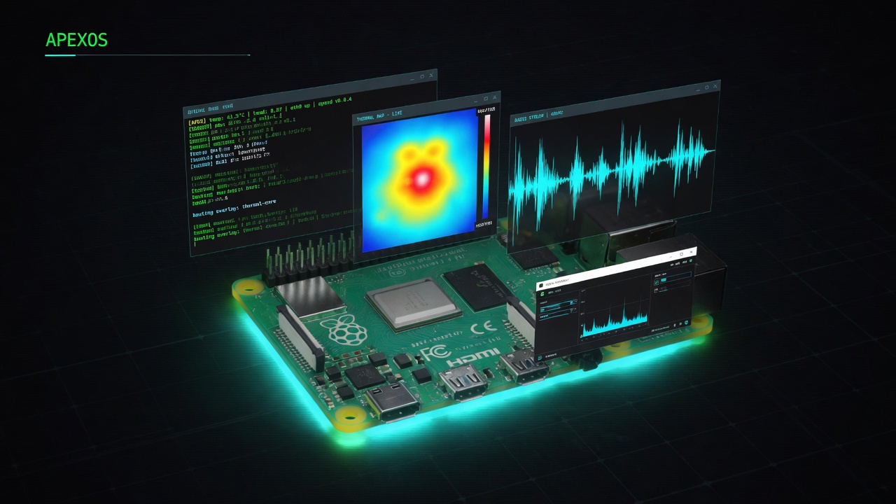

<div align="center">



# ApexOS

**Agent-first operating system layer for Raspberry Pi 5**

*A single Rust daemon that gives an AI agent eyes, ears, memory, voice, and a body — running entirely at the edge.*

[](https://www.rust-lang.org/)
[](https://www.raspberrypi.com/products/raspberry-pi-5/)
[](https://www.anthropic.com/)
[](LICENSE)

</div>

---

## What is this?

Most "AI at the edge" is a cloud service with a thin client bolted onto hardware. ApexOS is the inverse.

The Pi isn't running inference — **it is the agent's body.** A single Rust binary (`agentd`) wires together sensors, memory, voice, tools, and a windowed desktop UI into a coherent whole. The cloud supplies the LLM brain (Anthropic API); everything else lives on the board.

The result is an agent that:
- **Sees** the room via thermal camera and RGB cameras
- **Hears** you via a USB mic and whisper.cpp wake word detection
- **Speaks** back via Piper neural TTS
- **Remembers** everything via a persistent graph memory system (CerebroCortex)
- **Acts** on the world via 100+ MCP tools (shell, filesystem, HTTP, sensors, music generation)
- **Evolves itself** — proposes and applies changes to its own system prompt and policy rules
- **Wakes on voice** — say "apex" and it listens, responds, speaks

---

## Architecture

```
┌─────────────────────────────── Raspberry Pi 5 ───────────────────────────────┐
│                                                                                │
│  ┌──────────────────────────────────────────────────────────────────────┐     │
│  │                        agentd  (single Rust binary)                   │     │
│  │                                                                        │     │
│  │   core ──── broadcast bus ──── gateway (axum WebSocket + HTTP API)   │     │
│  │    │              │                                                    │     │
│  │  agent          store          plugins (MCP-over-stdio)               │     │
│  │  (turn)        (JSONL)        ┌──────────────────────────┐            │     │
│  │    │                          │ CerebroCortex  (memory)  │            │     │
│  │  policy                       │ apexos-tools   (shell/fs) │            │     │
│  │  engine                       │ sensor-head    (sensors)  │            │     │
│  │                               │ sonus          (music)    │            │     │
│  │                               └──────────────────────────┘            │     │
│  └──────────────────────────────────────────────────────────────────────┘     │
│                                                                                │
│  Hardware sensors          Voice I/O              Display                      │
│  BME688  · air quality     whisper.cpp  (STT)     cage kiosk (Wayland)         │
│  MLX90640 · thermal        piper        (TTS)     or any browser               │
│  camera  · rpicam          apex-wake    (wake)                                 │
│                                                                                │
└────────────────────────────────────────────────────────────────────────────────┘
                                      │
                              Anthropic API
                          (inference only — no data stored)
```

One `Event` type flows through the bus, the event log, and the WebSocket to the browser. Everything is a stream.

---

## Features

### Agent core
- **Streaming turns** with thinking-block retention across multi-turn conversations
- **Policy engine** — `suggest` / `auto-edit` / `yolo` modes × per-tool approval rules
- **Sub-agent orchestration** — `agent_spawn` virtual tool; child sessions with fan-out and cascade cancel
- **Council engine** — `convene_council` tool; 4 native AI personas (AZOTH / VAJRA / ELYSIAN / KETHER) run parallel rounds, score convergence, and synthesise a final answer; real-time streaming per agent column in the desktop UI; butt-in mid-session via API
- **Self-evolution** — `propose_evolution` tool; agent can live-patch its own soul.md and policy; rollback snapshots
- **Session persistence** — append-only JSONL per session; history replay with full context on reconnect
- **Scheduled tasks** — cron-driven autonomous turns via `schedule_task` virtual tool
- **Multi-backend inference** — hot-swap between Anthropic, Ollama, vLLM, and OpenRouter at runtime; Ollama cloud model filter (`:cloud` suffix) for on-demand frontier OSS models with no local storage
- **Agent-to-agent messaging** — `send_to_agent` virtual tool; fire-and-forget peer messages between live sessions; `POST /api/sessions/{id}/message` for external injection; inbox display in sub-agent windows
- **Event log RAG** — `query_event_log` virtual tool; query the append-only JSONL event log by time window and type; human-readable summaries for Cerebro ingestion; `GET /api/events/recent` for external consumers

### Senses & voice
- **Wake word** — `apex-wake` service: 3s ALSA chunks → whisper.cpp base.en → trigger
- **STT** — whisper.cpp (`/api/record/start` + `/api/record/stop`), sub-second on Pi 5, no PipeWire needed
- **TTS** — Piper neural voice (lessac-medium, 0.13× real-time on Pi 5)
- **Thermal camera** — MLX90640 32×24 live feed, rendered as canvas wallpaper and sensor stream
- **Air quality** — BME688 BSEC2: IAQ, temperature, humidity, pressure with alert routing
- **Camera** — rpicam-jpeg snapshots via `/api/snapshot`

### Desktop UI
- **Windowed OS shell** — WinBox 0.2.82, Alpine.js, no framework build step, no CDN
- **Agent window** — streaming text, collapsible tool calls, inline approval UX, mic + speaker buttons
- **Terminal** — real PTY via libc `openpty`, full interactive bash (vim, htop, colours)
- **Monaco IDE** — 0.55.1 bundled, Ctrl+S save, language auto-detect
- **File explorer** — two-pane lazy tree, upload, open in IDE/Notes
- **Sketchpad** — HTML5 canvas, pen/eraser, PNG download
- **Media player** — Sonus/Suno AI music generation + HTTP 206 range streaming
- **Council Chamber** — dynamic WinBox per council session; per-persona streaming columns, convergence bar, live butt-in
- **Sub-agent windows** — each child session gets its own WinBox with streaming output and approval buttons
- **Home dashboard** — live CPU temp, RAM, disk, IAQ badge, thermal mini-canvas, agent stats

### Infrastructure
- **MCP plugin system** — CerebroCortex, apexos-tools, sensor-head, sonus; 103 tools at runtime
- **Event log** — append-only JSONL per day, date-rolling, NVMe-backed
- **Hot reload** — live model swap, soul.md update, policy rule change, plugin registration without restart
- **Notifications** — JSONL log + notify-send toast + Piper TTS + ntfy.sh + Telegram (env-gated)

---

## Hardware

Tested on:
- **Raspberry Pi 5** (8GB) — Debian trixie, NVMe SSD boot
- **BME688** — air quality / environment sensor (BSEC2 library)
- **MLX90640** — 32×24 thermal camera
- **USB microphone** — any ALSA-compatible device
- **Camera** — any rpicam-compatible module

The Pi 5 specifically matters: sub-second whisper.cpp transcription, 0.13× real-time Piper synthesis, and thermal at 30s intervals — all concurrent. Pi 4 would struggle.

---

## Install

**Pi Imager (zero-touch)** — flash a fresh card and paste this into *"Run custom script on first boot"*:
```
https://raw.githubusercontent.com/buckster123/ApexOS/main/firstrun.sh
```
The Pi installs everything on first boot and reboots. Access at `http://apexos.local:8787`.

**One-liner** — SSH into a running Pi:
```bash
curl -fsSL https://raw.githubusercontent.com/buckster123/ApexOS/main/install.sh | sudo bash
```
Detects your hardware (mic, camera, sensors), asks a few questions, starts the service.

**Full manual** — see [`docs/install.md`](docs/install.md)

---

## Build roadmap

34 steps, all complete:

| # | Feature |
|---|---------|
| 1 | Core types + `state.apply()` — pure, unit-tested |
| 2 | Broadcast bus + WebSocket echo round-trip |
| 3 | MCP plugin supervisor — CerebroCortex wired (66 tools) |
| 4 | Agent turn engine — streaming, thinking-block retention, semaphore |
| 5 | Policy engine — suggest/auto-edit/yolo × per-tool rules |
| 6 | Sub-agent routing — parent/child sessions, cascade cancel |
| 7 | Pi deploy — agentd running, full WS round-trip smoke-tested |
| 8 | Event log — append-only JSONL, date-rolling |
| 9 | Frontend UI — terminal aesthetic, streaming, tool calls, approval UX |
| 10 | Cage kiosk — seatd, Wayland, agentos-kiosk user |
| 11 | Frontend controls — cancel, power modal, model selector, policy badge |
| 12 | Self-evolution — `propose_evolution`, live soul.md/policy patching |
| 13 | Session persistence — append-only JSONL, history replay, multi-client sync |
| 14 | apexos-tools — 11 MCP tools: shell, fs, HTTP, sysstat |
| 15 | Scheduled tasks — cron-driven autonomous turns, JSONL persistence |
| 16 | Notifications — TTS + toast + ntfy.sh + Telegram |
| 17 | Sensor bridge — BME688 air quality + MLX90640 thermal, bus events |
| 18 | Desktop skin Phase A — WinBox windowed OS shell |
| 19 | Desktop skin Phase B — start menu, taskbar, terminal, camera, thermal wallpaper |
| 20 | Desktop skin Phase C/D — notes, browser, sketchpad, explorer, Monaco IDE |
| 21 | Sonus music player — AI music generation + HTTP range streaming |
| 22 | Real PTY terminal — libc `openpty`, resize, full interactive shell |
| 23 | Sub-agent windows v2 — tools/results/approval in child WinBox |
| 24 | Home dashboard — live system, environment, agent stats |
| 25 | Voice I/O — whisper.cpp STT + Piper TTS, server-side ALSA recording |
| 26 | Wake word — `apex-wake` service, `Ctrl+Space` manual trigger, auto voice turn |
| 27 | Multi-inference backend — Anthropic / Ollama / vLLM / OpenRouter; hot-swap at runtime |
| 28 | Council engine — parallel AI persona rounds, convergence scoring, synthesis; desktop Council Chamber UI |
| 29 | Council persistence + Cerebro hook — per-session JSONL log; post-synthesis memory store |
| 30 | A2A messaging — `send_to_agent` peer tool; `GET /api/sessions/active`; inbox display in sub-agent windows |
| 31 | RAG over event log — `query_event_log` virtual tool; `GET /api/events/recent`; agents can query and digest system history |
| 32 | Sensor anomaly wakeup — per-type cooldown (30 min default); configurable thresholds; `ThermalFrame` hotspot detection; no-spam guaranteed |
| 33 | Event log timeline — desktop window; time range + type filter + auto-refresh; color-coded badges for 16 event types |
| 34 | Mobile PWA — `/mobile` touch UI; `manifest.json` → Android home screen; voice I/O; inline approvals; wake word |

---

## Philosophy

Current AI deployment is top-down: a general-purpose model in a data centre, thin clients everywhere else. ApexOS is bottom-up. The hardware is the agent's body — not a display terminal, not a retrieval node, a *body*. It has proprioception (sensors), voice, memory, and the ability to rewrite its own behaviour. The cloud supplies cognition; the Pi supplies presence.

This is what embedded AI looks like when you don't treat the hardware as an afterthought.

---

## License

MIT
